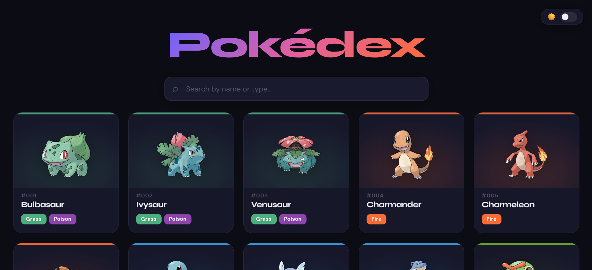
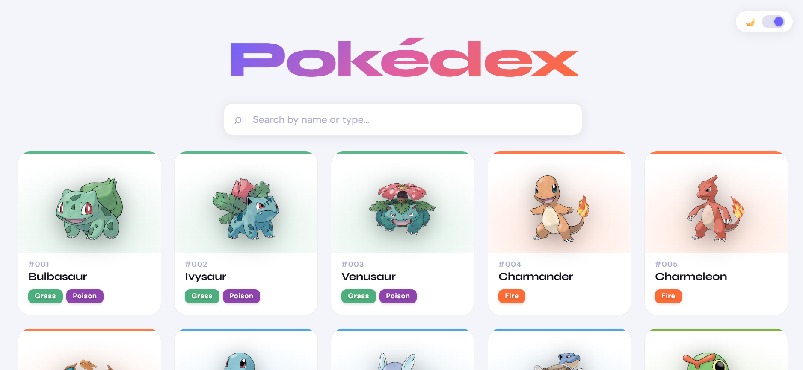
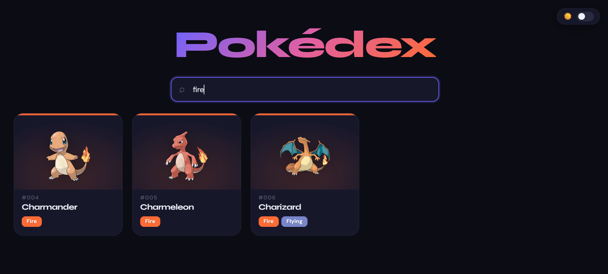
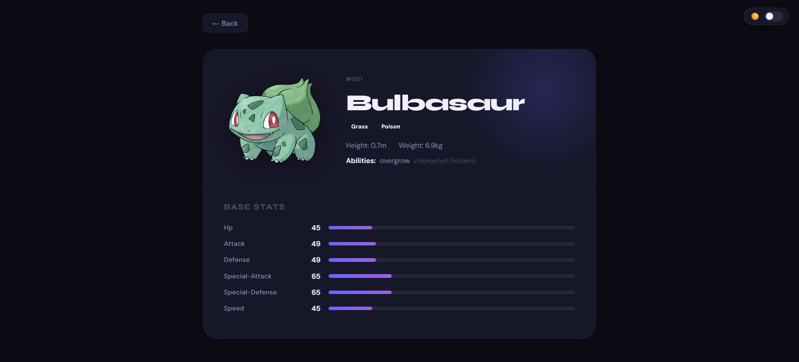
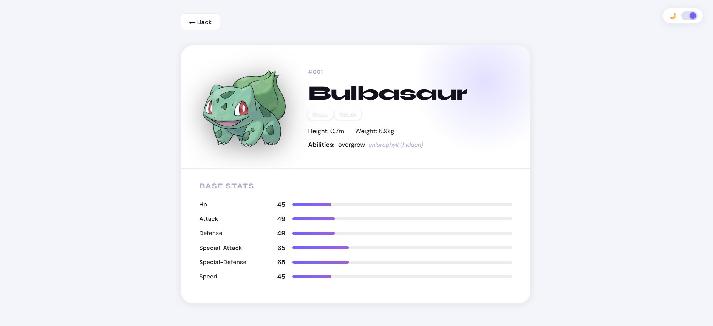
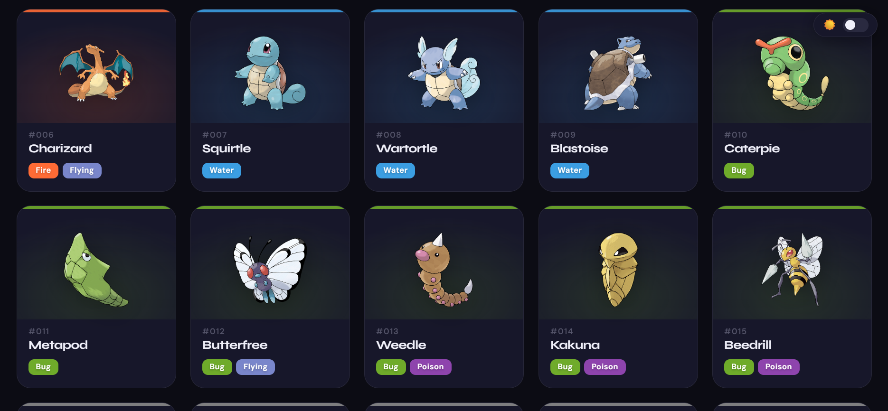
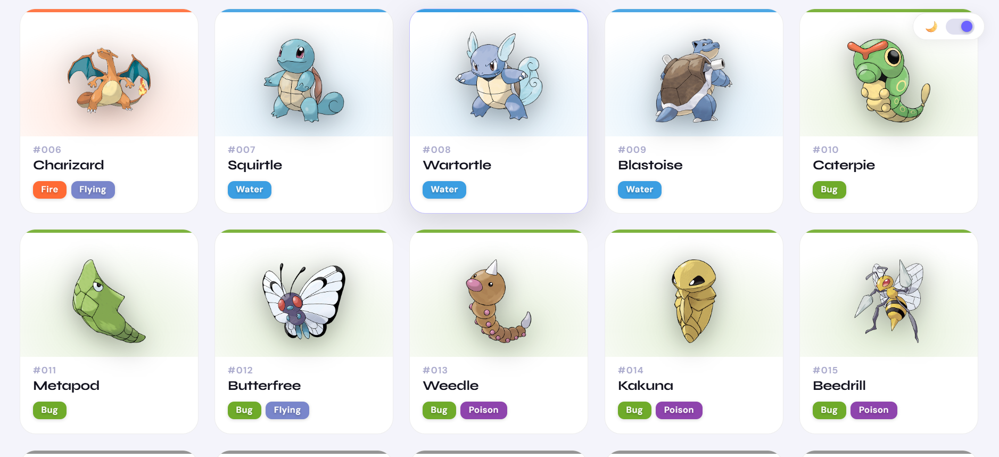

# Pokédex 

> A production-grade Pokémon browser built with React, following strict Test-Driven Development practices. Every architectural decision, every line of code, every commit — intentional.

---

## Screenshots

### Listing Page in Dark theme 

### Listing Page in Light theme 

### Filter by Type 

### Detail Page in Dark theme 

### Detail Page in Light theme 

### All Cards in Dark theme 

### All Cards in Light theme 

---

## Features

- **Pokémon Listing** — Browse Pokémon displayed as cards in a responsive grid layout
- **Search & Filter** — Filter Pokémon in real-time by name or type (e.g. "fire", "grass", "poison")
- **Infinite Scroll** — Loads 10 Pokémon at a time; fetches more as you scroll toward the bottom
- **Scroll Loading Bar** — Animated progress indicator appears while the next batch is being fetched
- **Pokémon Detail Page** — Click any card to view full stats, abilities, height, weight, and type breakdown
- **Light / Dark Theme** — Toggle between dark and light mode with smooth transitions and a consistent design across both
- **Error & Loading States** — Every async operation has appropriate UI feedback
- **Keyboard Accessible** — Cards respond to Enter key; all interactive elements have ARIA labels
- **Responsive Design** — Works across all screen sizes

---

## Tech Stack

| Layer | Choice | Reason |
|---|---|---|
| Framework | React 18 | Component model, hooks, ecosystem |
| Bundler | Vite | Fast HMR, modern ESM-first build |
| Routing | React Router v6 | Declarative, nested routes |
| Testing | Vitest | Vite-native, fast, Jest-compatible API |
| DOM Testing | Testing Library | User-centric, behaviour-focused assertions |
| Data Source | [PokéAPI](https://pokeapi.co/) | Free, reliable, RESTful Pokémon API |
| Deployment | Netlify | Zero-config, instant deploys from Git |

---

## Architecture

```
src/
├── components/
│   ├── PokemonList.jsx        # Grid view with search and infinite scroll
│   ├── PokemonList.test.jsx
│   ├── PokemonCard.jsx        # Individual Pokémon card with type colours
│   ├── PokemonCard.test.jsx
│   ├── PokemonDetail.jsx      # Full detail view with base stats
│   ├── PokemonDetail.test.jsx
│   ├── SearchBar.jsx          # Controlled search input
│   ├── SearchBar.test.jsx
│   └── ThemeToggle.jsx        # Light / dark mode toggle button
├── hooks/
│   ├── usePokemonList.js      # Fetch, pagination, infinite scroll, filtering
│   ├── usePokemonList.test.js
│   ├── usePokemonDetail.js    # Single Pokémon fetch with cleanup
│   └── usePokemonDetail.test.js
├── service/
│   ├── pokemonService.js      # Pure API abstraction layer
│   └── pokemonService.test.js
├── constants/
│   └── typeColors.js          # Single source of truth for type → colour mapping
├── App.jsx                    # Router: / and /pokemon/:name + theme state
├── App.test.jsx
└── setupTests.js              # jest-dom matchers
```

### Layer Responsibilities

**`service/`** — knows nothing about React. Pure async functions that talk to PokéAPI and throw meaningful errors. Trivially mockable in tests.

**`hooks/`** — knows nothing about UI. Owns state, side effects, and business logic (pagination, filtering). Components stay declarative.

**`components/`** — knows nothing about fetching. Receives data and callbacks as props. Renders UI and delegates decisions upward.

This separation means every layer is independently testable without mounting the whole application.

---

## TDD Approach

This project follows a strict **Red → Green → Refactor** loop. The commit history is the proof.

```
test: add failing tests for pokemonService        ← RED
feat: implement pokemonService                    ← GREEN
test: add failing tests for usePokemonList hook   ← RED
feat: implement usePokemonList hook               ← GREEN
refactor: add infinite scroll and offset logic    ← REFACTOR
test: add failing tests for PokemonCard           ← RED
feat: implement PokemonCard component             ← GREEN
...
```

---

## Setup Instructions

```bash
# Clone the repo
git clone https://github.com/raghvendrapratap1/pokedex-app.git
cd pokedex-app

# Install dependencies
npm install

# Start development server
npm run dev

# Run tests in watch mode
npm test

# Run tests with coverage report
npm run coverage

# Build for production
npm run build
```

**Node version:** 18+ recommended

---

## Running Tests

```bash
npm test              # Watch mode — re-runs on file save
npm run coverage      # Coverage report in /coverage
```

All 39 tests pass across 8 test files covering:

- `pokemonService` — API success, failure, and custom params
- `usePokemonList` — loading state, error state, filtering by name, filtering by type, infinite scroll offset
- `usePokemonDetail` — loading, success, error, cleanup on unmount
- `PokemonCard` — render, id formatting, type badges, click navigation, keyboard navigation, dual types
- `SearchBar` — render, controlled value, onChange callback
- `PokemonList` — loading state, error state, empty state, grid render, search delegation
- `PokemonDetail` — loading, error, name, id, types, stats bars, back navigation
- `App` — routing renders correct page

---

## Architectural Decisions & Trade-offs

### Infinite Scroll vs Pagination
Chose **infinite scroll** because it's more natural for a card-browsing experience. The trade-off is that users can't jump to a specific page, but for a Pokédex the discovery pattern fits scroll better than pagination.

### Upfront Batch Fetching (10 at a time)
PokéAPI's `/pokemon` list endpoint returns only names and URLs — not full data. Each card needs type info and sprites, which require individual detail requests. Loading 10 at a time (`Promise.all`) balances perceived performance against network load.

**Alternative considered:** Virtual scrolling with a single large fetch. Rejected because 151 concurrent requests would hammer the API and delay initial render significantly.

### Light / Dark Theme
Theme state lives in `App.jsx` and is applied via a `data-theme` attribute on `document.documentElement`. CSS variables swap the entire design token set — no runtime JS overhead, no flicker. The toggle component is decoupled and receives a callback prop.

### No Global State Library
React's built-in `useState` + custom hooks is sufficient here. Adding Redux or Zustand would be over-engineering for an application with two routes and no shared mutable state between them.

### Client-side Filtering
Filtering happens on already-fetched data rather than via API query params. This gives **instant, zero-latency search** as the user types. The trade-off is that search only covers Pokémon fetched so far. For Gen-1 scope this is a reasonable constraint.

### `isFetching` ref vs state
Used `useRef` (not `useState`) for the in-flight guard to avoid triggering re-renders and to avoid stale closure issues inside the scroll event listener.

---

## What I Would Add With More Time

- **Pokémon evolution chain** on the detail page
- **Type effectiveness chart** (weaknesses and resistances)
- **Favourite / bookmark** Pokémon with localStorage persistence
- **Skeleton loading cards** instead of a plain loading message on initial load
- **E2E tests** with Playwright covering the full listing → detail navigation flow
- **Error boundary** component to catch unexpected render errors gracefully
